# 🎮 GG-LOOTBOX – Gaming Accessories E-commerce Store

Welcome to **GG-LOOTBOX**, your ultimate destination for high-performance gaming gear. This full-stack project is built using **Next.js (Frontend)** and **Django (Backend)**, providing a lightning-fast, visually stunning, and fully functional shopping experience.

---

## 🚀 Tech Stack

| Frontend              | Backend       | Database | Auth                            | Integrations         |
|-----------------------|---------------|----------|----------------------------------|----------------------|
| Next.js + Tailwind CSS | Django + DRF | MySQL    | Firebase (Email/Password, Google) |, EmailJS  |

---

## 🧩 Features

- 🔍 **Advanced Product Search** with category & typo support  
- 🧡 **Wishlist** & 🛒 **Cart** using Zustand (Global State)  
- 💸 **Add to Cart + Checkout** with real-time total and coupon support  
- 📦 **Order Tracking** and **My Orders** history  
- 🧾 **Product Details Page** with:
  - Sticky image gallery
  - Variant support
  - FAQs, Reviews, and Ratings breakdown
  - Recommendations (You Might Also Like)

   📧 **Email Contact Form – powered by EmailJS**  
- 📬 **Newsletter Signup**, SEO tags, and responsive design  

---

## 👥 Pages

- Home (`/`)
- All Products (`/products`)
- Product Detail (`/product/[slug]`)
- Wishlist (`/wishlist`)
- Cart (`/cart`)
- Checkout & Address Form
- About Us
- Contact Us
- My Orders (`/my-orders`)
- Admin Panel (for order management)

---

## 🔐 Authentication

- 🔓 Firebase Login with Email/Password
- 🔵 Google Login Integration
- 👤 User dropdown in Navbar with Logout

---
## 📧 Email Support (EmailJS)

Allow users to send messages via contact form without a backend.

### Setup:
- Create `.env.local` in `frontend/`:
  ```env
  EMAILJS_SERVICE_ID=your_service_id
  EMAILJS_TEMPLATE_ID=your_template_id
  EMAILJS_PUBLIC_KEY=your_public_key
---
## 🛠️ Setup Instructions

1. Clone the repo  
2. Run backend:
   ```bash
   cd backend
   pip install -r requirements.txt
   python manage.py runserver
   ```

3. Run frontend:
   ```bash
   cd frontend
   npm install
   npm run dev
   ```

---

## 📸 Project Preview

### 🏠 Homepage
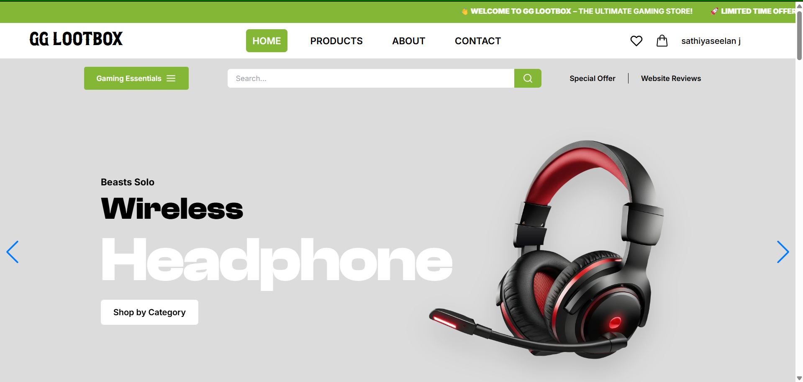

### 🏠 Homepage - Alt Layout
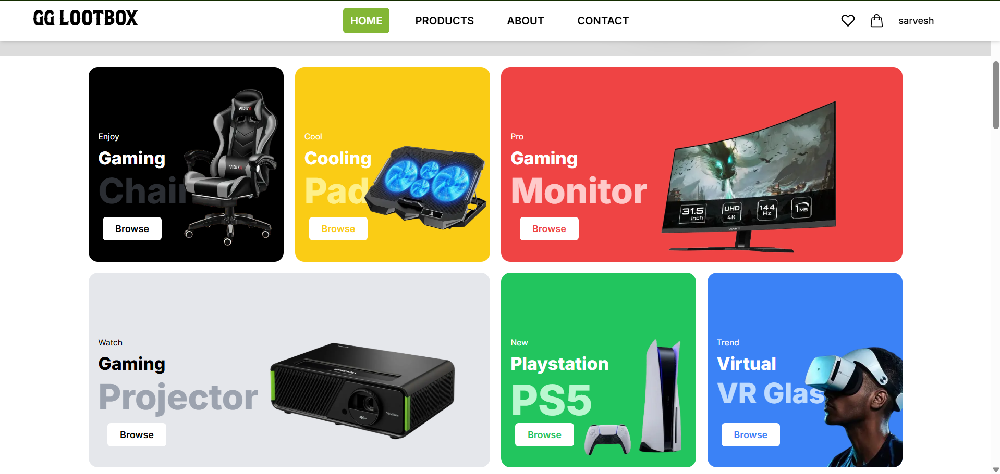

### 🛍️ All Products Page
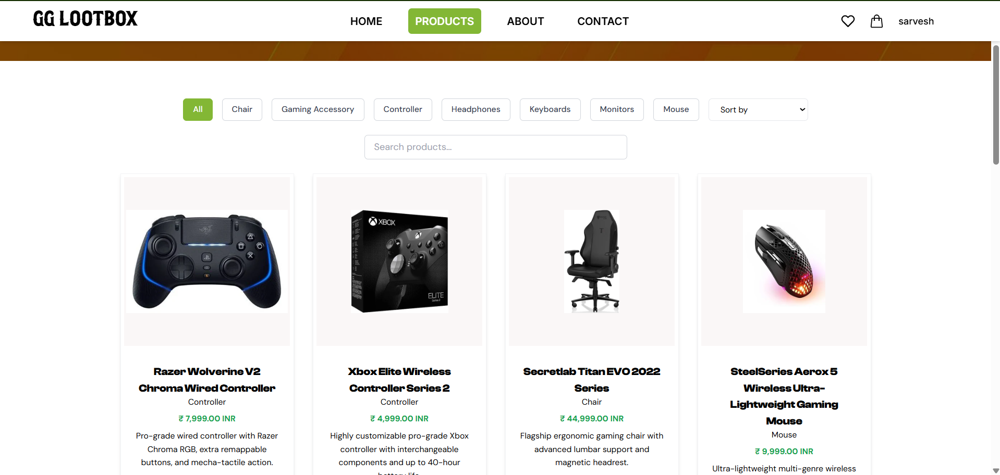

### 🔎 Product Detail Page
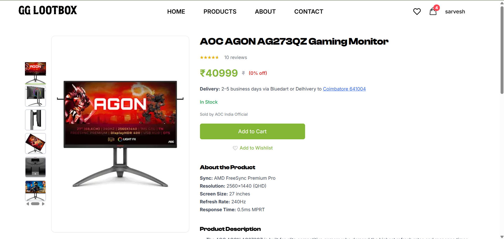

### 💖 Wishlist Page
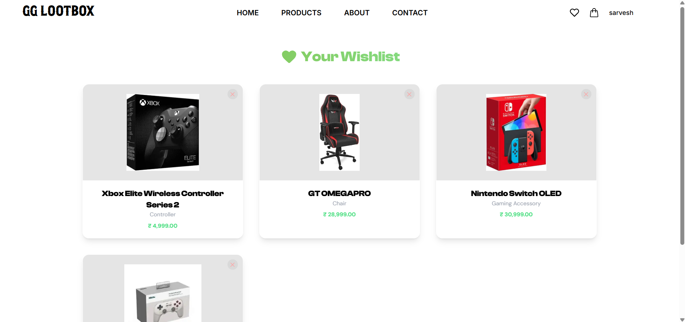

### 🛒 Add to Cart Page
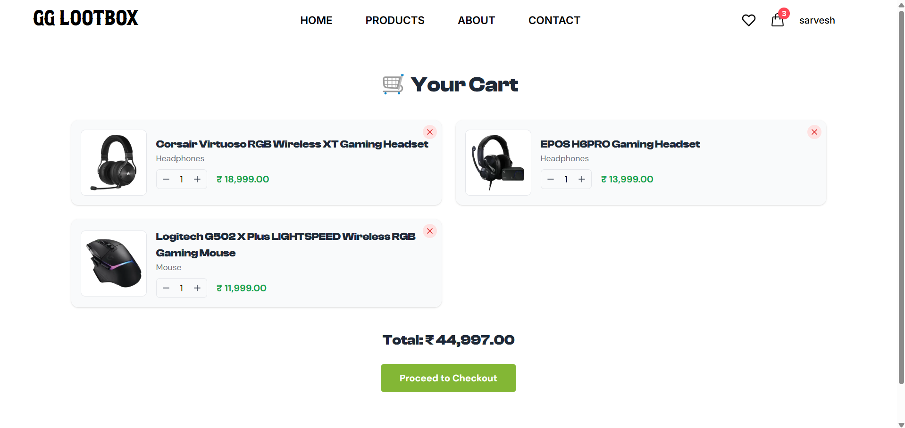


### ✅ Checkout Page
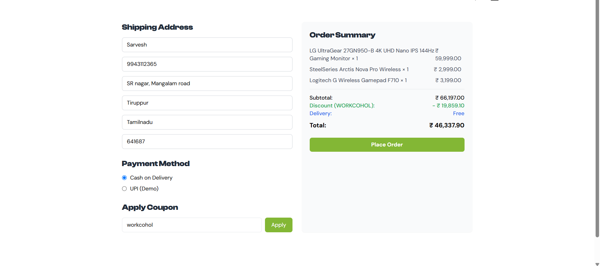

### 🎉 Order Placed Confirmation
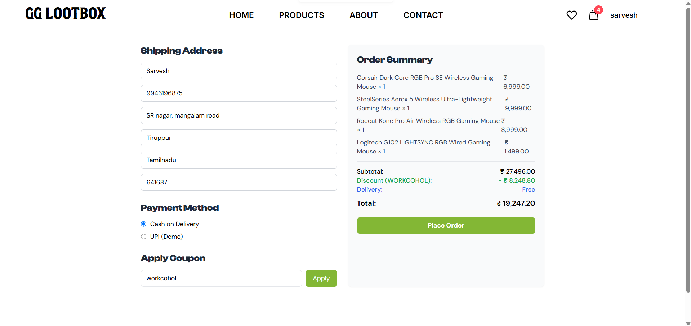

### 📦 My Orders
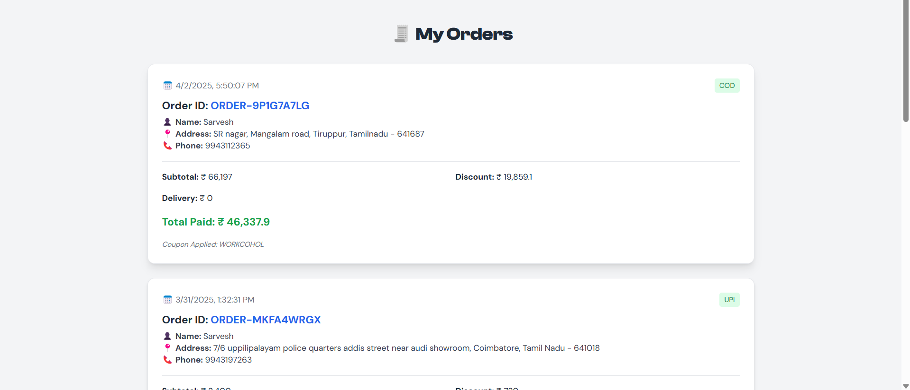

---

## 🗄️ Database Design

### 📊 Database Structure - View 1
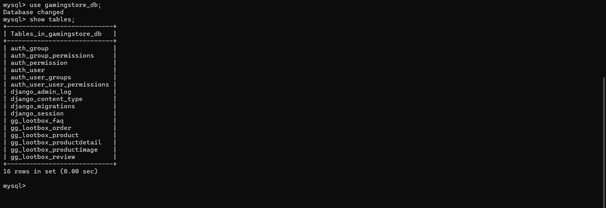

### 📊 Database of products - View 2
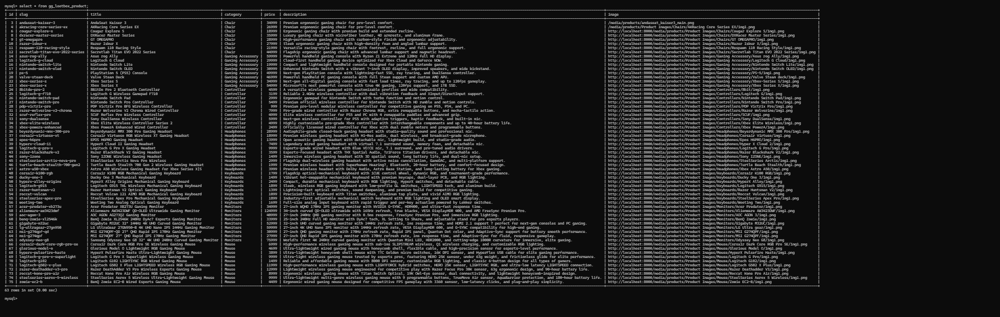

---

## 🧰 Django Backend Page

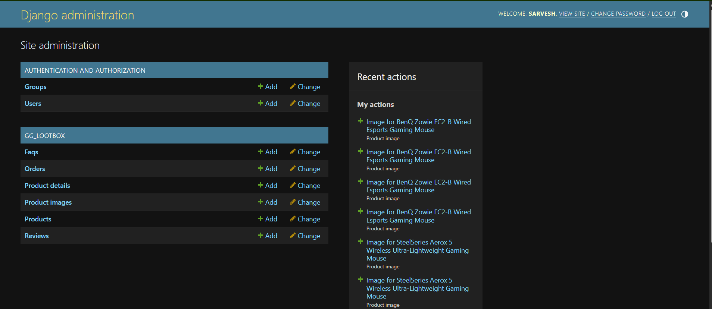

---

## ✨ Credits

Project developed by:
- **Sarvesh Kumar R**
- **Sreevan Kumar S**
- **Sanjay S**
- **Sathiyaseelan J**

---

## 📄 License

MIT License

For more details, see the [LICENSE](LICENSE) file.
